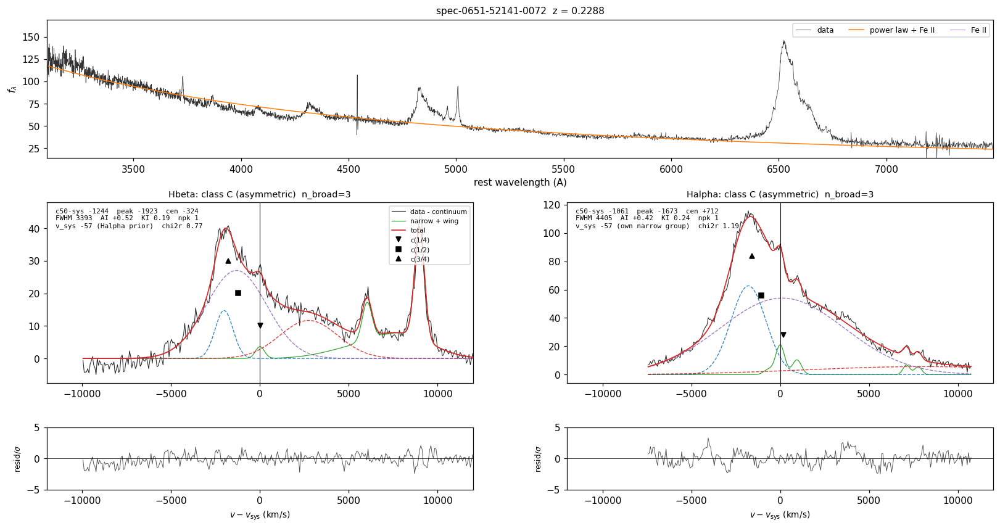
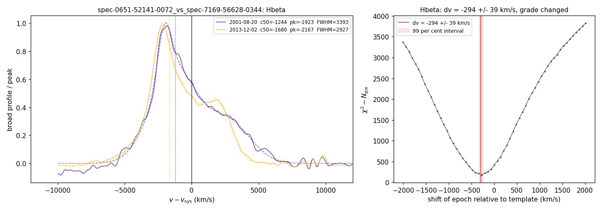

# blrfit

Fits the broad Hα, Hβ (and Mg II) emission lines of an active galactic nucleus against the
systemic velocity defined by the narrow lines of the same spectrum, measures the displacement
and shape of the broad profile, classifies it, flags the conditions under which the measurement
should not be trusted, and measures the change of the broad-line velocity between two epochs by
cross-correlation. It is the fitter behind the DESI search for sub-parsec supermassive black hole
binaries, released so that the measurements can be reproduced on the same or on other data.

Input: a DESI coadd, an SDSS spec file, or any table with a wavelength, a flux and an error
column. Output: a table on the terminal, a JSON file with every quantity, and a diagnostic
figure. The physics is fixed: every number that defines the model, a class, a flag or a selection
is set to the value used for the DESI catalogue and is listed, with its reason, in
`blrfit/constants.py`; tolerances of the fitting machinery stay next to the code they serve.



*SDSS J001224.01−102226.5 (SDSS spectrum of 2001, z = 0.2288), one of the binary candidates of
Eracleous et al. (2012): the continuum decomposition on top, the Hβ and Hα complexes below with
the narrow model (green), the broad components (dashed), the total (red), the c(1/4), c(1/2),
c(3/4) bisector points and the residuals. Both lines are displaced by more than 1000 km/s from
the narrow lines and classified C (asymmetric).*

## Install

```bash
pip install git+https://github.com/ektrnddn/blrfit.git
```

Python ≥ 3.9 with numpy, scipy, astropy and matplotlib; from a clone, `pip install .`. Optional
extras: `blrfit[fetch]` (astroquery, fsspec, aiohttp, requests) for downloading public spectra,
`blrfit[desi]` to read DESI files through desispec instead of the built-in reader (the two give
identical arrays), `blrfit[dust]` for dust-map look-ups of E(B−V), `blrfit[test]` (pytest, healpy)
for the test suite. Tests: `python -m pytest -m "not slow and not network"` from the clone runs
the fast suite (about 5 minutes); `-m slow` adds the full synthetic grids, the Monte Carlo pulls
and, with `BLRFIT_ANCHOR_DIR` set, the Liu et al. (2014) anchor (`tests/test_anchor_liu.py`).

## Quick start

```bash
blrfit fit spec-0651-52141-0072.fits --z 0.2288
blrfit fit coadd-main-dark-17260-39627574082538900.fits --targetid 39627574082538900   # z from the redrock file next to it
blrfit fit J001224_rest_air_nm.csv --wave lambda_nm --flux f_lambda --err sigma --wave-unit nm --frame rest --air --z 0.2288 --flux-scale 10
blrfit rv spec-0651-52141-0072.fits spec-7169-56628-0344.fits --z 0.2288 --line Hbeta
blrfit fetch --ra 3.1997083 --dec -8.7834722 --out spectra/                # public SDSS and DESI spectra of a position
```

The `examples/data` directory holds the files used above (two SDSS epochs of J001224, a DESI DR1
coadd reduced to one target with its redrock file, a CSV with rest-frame air wavelengths in nm)
and `examples/README.md` the commands that run them with the expected results. From Python:

```python
from blrfit import read_spectrum, fit_spectrum, summary_row, plot_fit
sp  = read_spectrum("spec-0651-52141-0072.fits")                      # or read_desi(path, targetid), read_table(...)
res = fit_spectrum(sp["wave"], sp["flux"], sp["ivar"], z=0.2288, complexes=("Halpha", "Hbeta"), nmc=30)
res["meas"]["Hbeta"]["c50_sys"], res["err"]["Hbeta"]["c50_sys"], res["cls"]["Hbeta"]["label"]   # err is empty without nmc
row = summary_row(res)                                                  # one flat dictionary (HA_*, HB_*, conti_*)
```

`fit_spectrum` needs the observed-frame vacuum wavelength in Å, the flux in any linear unit
(1e-17 erg s⁻¹ cm⁻² Å⁻¹ if luminosities are wanted), the inverse variance, and the redshift.
The redshift only sets the ±1500 km/s window in which the narrow lines are sought: every velocity
reported is a difference between two quantities measured in the same fit, so errors in the input
redshift cancel to first order.

## What is measured

The summed broad model P(v), evaluated on a 5 km/s grid, is reduced to the non-parametric
quantities of Marziani et al. (1996) and Eracleous et al. (2012): the peak velocity, the
flux-weighted centroid, the bisector centres c(f), the midpoints between the two outermost
crossings of the profile with f times its peak, and the widths W(f) for f = 1/4, 1/2, 3/4 and
0.9 (FWHM ≡ W(1/2)); the asymmetry index A.I. = [v_R(1/4) + v_B(1/4) − 2 v_peak] / W(1/4); the
kurtosis index K.I. = W(3/4)/W(1/4), 0.456 for a Gaussian; the number of resolved peaks (local
maxima above 20 per cent of the maximum with a prominence of 5 per cent), their separation and
the dip between them; the broad flux, its equivalent width against the total continuum, its
luminosity, and the integrated and peak signal-to-noise ratios. All velocities are referred to
the systemic velocity v_n of the same fit.

The primary offset is **Δv ≡ c(1/2) − v_n**, the displacement of the half-maximum bisector. The
peak of a multi-component model is unstable for flat-topped or two-humped profiles, and the
centroid weighs precisely the faint wings on which different decompositions of the same profile
legitimately disagree; c(1/2) is the most robust of the three. The peak- and centroid-based
offsets are reported alongside, together with the peak of the continuum- and narrow-line-
subtracted data measured as in Eracleous et al. (2012) (a parabola through the smoothed profile
above 80 per cent of its maximum), which is compared with the model peak (flag `peak_disagree`).

## The model

The model follows the recipe of the SDSS quasar catalogues and of the earlier single-epoch
searches (Shen et al. 2011; Eracleous et al. 2012; Liu et al. 2014), with a small number of
departures forced by the host-dominated spectra of a DESI broad-line sample. Every line
component is a Gaussian in wavelength, F(λ) = A exp[−(λ − λ_c)²/2σ_λ²] with λ_c = λ₀(1 + v/c)
and σ_λ = λ_c σ/c.

**Pre-processing.** Galactic extinction is removed with the Cardelli, Clayton & Mathis (1989)
law and the O'Donnell (1994) optical coefficients, R_V = 3.1. A fractional error floor of 2 per
cent of the flux is added in quadrature: the narrow-line cores of bright galaxies reach per-pixel
signal-to-noise ratios of several hundred, where the residuals of any line model are limited by
the spectrophotometric calibration and would otherwise dominate χ² and drag the broad components.

**Continuum.** A power law A(λ/3000 Å)^α with −5 ≤ α ≤ 3, the optical Fe II template of Boroson &
Green (1992) and the ultraviolet composite of Vestergaard & Wilkes (2001), Salviander et al.
(2007) and Tsuzuki et al. (2006) assembled as in Shen et al. (2011) (each convolved to a free FWHM
between 1200 and 10 000 km/s, free normalisation, small velocity shift), and a host galaxy
built from up to five galaxy eigenspectra of Yip et al. (2004), fitted jointly by weighted least
squares in the line-free windows of Shen et al. (2011) plus every line-free pixel inside the
galaxy-template range (so that the 4000 Å break and the stellar absorption anchor the host).
Pixels deviating by more than 3σ below or 5σ above the first solution are masked once and the
fit repeated. The number of eigenspectra is stepped down (5 → 3 → 2 → 1 → 0) until the host is
non-negative everywhere; the host is kept only if it contributes at least 10 per cent of the
4200–5000 Å flux (Shen et al. 2011). Departure: the host contributes continuum only underneath
the emission lines. The eigenspectra are principal components of real galaxy spectra and contain
emission lines whose strengths the line-free fit does not constrain; subtracting the full host
displaced the systemic velocity by up to 450 km/s in strongly star-forming DESI hosts. The host
model within ±900 km/s of every catalogued line is therefore replaced by a linear interpolation.

**Narrow lines.** Two complexes are fitted after continuum subtraction: Hα (rest 6400–6800 Å:
narrow and broad Hα, [N II] λλ6548, 6584, [S II] λλ6716, 6731) and Hβ (4700–5100 Å: narrow and
broad Hβ, He II λ4686, [O III] λλ4959, 5007). Doublet ratios are fixed, [N II] 6584/6548 = 2.96
and [O III] 5007/4959 = 2.98; narrow widths are 25 ≤ σ ≤ 510 km/s (FWHM ≤ 1200). Narrow Hα and
[N II] share one velocity v_n and one width; [S II] has its own, tied softly by Gaussian priors
(σ within 20 per cent, v within 60 km/s), because a hard tie leaves residuals at [S II] in
high-signal-to-noise host galaxies that the fit absorbs with a spurious broad Gaussian at
+7000 km/s, and a free [S II] removes the anchor that defines the narrow width in quasars. A
narrow-line-region wing, a second Gaussian under every narrow line of the Hα complex with a
common amplitude fraction f_w ≤ 0.5 (weak prior σ_f = 0.25 towards zero), one velocity tied to v_n by
a Gaussian prior of width 150 km/s and one width between σ_n and 510 km/s, absorbs the non-Gaussian bases that AGN
narrow lines carry (Heckman et al. 1981; Whittle 1985). Without it, the information criterion
buys "broad" components of FWHM 1200–2000 km/s on those bases: in a synthetic spectrum with 25
per cent of the narrow flux in a base three times wider than the core, a broad Hα injected at
+800 km/s came back at +379 km/s without the wing and at +803 km/s with it. Pinned by [N II] and
[S II], which have no broad counterpart, the wing cannot masquerade as broad Hα; it is excluded
from every broad-profile measure. In the Hβ complex the [O III] doublet is a core (σ ≤ 800 km/s)
plus the blueshifted wing (σ 250–2500 km/s, v between −2500 and +500 km/s), ordered by two hinge
penalties (wing at least as wide as the core, core at least as tall as the wing) so that the two
cannot exchange roles; the core is started at the smoothed data peak near 5007 Å rather than at
zero velocity. When the Hα narrow lines are detected (peak S/N ≥ 3), the velocity and width of
narrow Hβ and He II and the wing are fixed to the Hα values; otherwise they are tied to the
[O III] core as in Shen et al. (2011).

**Systemic velocity.** v_n is the velocity of narrow Hα + [N II] (with [S II] attached), the
narrow-line system least affected by outflows and available for every object. It may lie within
±1500 km/s of the input redshift, because the pipeline redshift of a broad-line object is driven
by the broad lines themselves (SDSS J102106.04+452331.8 of Eracleous et al. 2012 has its narrow
lines 880 km/s from its catalogue redshift). Against the misassociation that the wide window
allows ([N II] λ6584 mistaken for narrow Hα displaces v_n by 940 km/s, and under a very broad Hα
the misassigned solution can have marginally lower χ²), a preliminary Hβ fit provides an [O III]
velocity from which the Hα group is started in addition to zero, and, when the [O III] core has
S/N ≥ 10, a Gaussian prior of 150 km/s pulls v_n towards it. Strong narrow lines override the
prior; a remaining disagreement above 400 km/s is flagged. On the sky the reference systems agree:
over the measurable objects of the DESI catalogue sample, [S II] deviates from v_n by +3 ± 17 km/s
and the [O III] core (where it has S/N ≥ 10) by −4 ± 28 km/s (median ± NMAD, catalogue run).

**Broad line.** One to three Gaussians with 1200 ≤ FWHM ≤ 15 000 km/s and centres within
±8000 km/s of the line (individual components of the disk-like profiles of Eracleous et al. 2012
reach −6300 km/s; a ±5000 km/s bound truncated the wings of double-peaked profiles and roughly
halved their widths). Only their sum is measured. The number of components is chosen with the
Bayesian information criterion, BIC = χ² + k ln N: the fewest components unless a more complex
model improves the BIC by more than 10. Each fit is repeated from starting velocities 0, ±1500
and ±3000 km/s of the first component (and, for Hα, from two starts of the narrow group), and the
lowest-χ² solution is kept; the solver is scipy's bounded trust-region least squares. A hinge
penalty enforces FWHM ≥ 0.4 |v|, so that a component at +7000 km/s must be at least 2800 km/s
wide and cannot be parked on [S II] (+7020 and +7680 km/s from Hα) or on [O III] λ4959 (+6020
km/s from Hβ) to absorb narrow-line residuals, while genuine disk-emitter components (FWHM
3000–5000 at |v| 5000–8000 km/s) are untouched. A complex is fitted only if the data extend
3500 km/s beyond the line on both sides, the broad centres are confined to the covered range
less 1000 km/s, and coverage below ±6000 km/s is flagged `edge` (Hα at z ≳ 0.477 runs off the red
end of DESI; unconstrained fits placed components outside the data and manufactured offsets of
+4000 to +8000 km/s).

## Classes and flags

The rules are applied in the order listed: a profile takes the first class whose condition
holds. The significance test of class A uses the Monte Carlo error when one was computed
(`--nmc`, as in the catalogue with 30 realisations) and the 300 km/s threshold alone otherwise,
so a class can differ between runs with and without the Monte Carlo.

| Class | Rule |
|---|---|
| **E** no broad line | FWHM < 1200 km/s, or integrated S/N < 5, or peak S/N < 1.5 |
| **X** no systemic | narrow-line reference not detected (S/N < 3) |
| **W** not classifiable | FWHM < 2000 km/s or integrated S/N < 8: something broad is there, but narrow-line residuals dominate such profiles |
| **B** double-peaked / disk-like | two resolved peaks separated by > max(0.4 FWHM, 1500 km/s) with a dip > 8 per cent and FWHM ≥ 3000; or FWHM ≥ 7000 with A.I. ≥ 0.20 or K.I. ≥ 0.50 |
| **A** bulk shift | \|Δv\| > 300 km/s at > 3σ (when an error is available) and a symmetric profile: \|c(1/4) − c(3/4)\| < 0.10 FWHM, \|A.I.\| < 0.12, \|v_peak − centroid\| < 0.20 FWHM |
| **C** asymmetric | single-peaked and not symmetric |
| **F** normal | symmetric, no significant offset |

B and C are not cleanly separable from single-epoch shape statistics: in the double-peaked
emitters of Strateva et al. (2003) that DESI has observed, the K.I. distribution is
indistinguishable from that of class C, and a physical separation would require disk-model fits
(Eracleous & Halpern 1994). The operative distinction is A against the rest.

| Flag | Condition |
|---|---|
| `very_broad` | FWHM ≥ 8000 km/s |
| `poor_fit` | reduced χ² ≥ 2.5 |
| `low_snr` | integrated broad S/N < 10 |
| `low_peak_snr` | broad peak < 5σ per pixel: a component significant only by integration over thousands of km/s is degenerate with continuum-subtraction residuals |
| `host_dominated` | host ≥ 80 per cent of the 4200–5000 Å light: template mismatch at the few-per-cent level mimics a very broad line |
| `pl_at_bound` | power-law slope at a bound |
| `peak_disagree` | model peak and data peak differ by > 0.25 FWHM |
| `sii_disagree` | [S II] velocity > 150 km/s from v_n |
| `sys_disagree` | v_n and the [O III] core > 400 km/s apart ([O III] S/N ≥ 5) |
| `narrow_at_bound` | narrow group at the edge of its ±1500 km/s window |
| `edge` | data cover less than ±6000 km/s around the line |
| `extreme_offset` | \|Δv\| > 4000 km/s (classes A, C and F; a class-B profile is not flagged): beyond the Roche ceiling of almost any bound binary; a disk-emitter component, an artefact or a misidentified line |

A measurement with no flag is *clean*. The DESI catalogue definitions are provided as functions:
*measurable* = class A/B/C/F, integrated S/N ≥ 8, FWHM ≥ 2000 km/s, no `edge`; *strong offset* =
measurable and 1000 ≤ |Δv| ≤ 4000 km/s. Both lines are always fitted when the data cover them;
in the DESI catalogue the selection, classes and Δv are Hα quantities and Hβ is the independent
cross-check.

## Errors

**Monte Carlo** (`--nmc 30`, `fit_spectrum(nmc=30)`): the spectrum is perturbed with Gaussian
noise from its error array and refitted with the host model held fixed and the number of broad
components fixed to the selected one; the error is half the 16th–84th percentile range (as in
Shen et al. 2013 and Liu et al. 2014). This is the statistical error only.

**Empirical model** (`dv_err_model` in the output): the total error of Δv, including the
systematics of the continuum and narrow-line decomposition, was measured on the sky from 8377 pairs
of independent DESI spectra of the same objects (observed in two programmes, or in survey
validation and the main survey) in which broad Hα is measurable in both. The two values of c(1/2)
agree to an NMAD of 103 km/s per pair, 73 km/s per measurement, declining from 246 km/s per pair at
integrated S/N 8–20 to 67 km/s above 150. The adopted per-measurement error is

    σ(Δv) = max(650 km/s / √(S/N), 45 km/s),

inflated by 1.5 for strong offsets (|Δv| ≥ 1000 km/s), whose profiles are broader and more complex
(256 km/s per pair, about 180 per measurement); the DESI catalogue and its inspection pages, which
consist of strong-offset objects, apply the factor 1.5 throughout. The Monte Carlo errors of the
strong-offset objects have a median of 123 km/s, so the decomposition systematics are of the same
order as the statistical error. The model was calibrated on broad Hα in DESI spectra; for other
lines and instruments it is an indication, not a measurement, and it is reported only for
measurable lines (classes A, B, C, F). When the Monte Carlo error is much larger than the model
error, as for the worked example (±287 against ±68 km/s in Hα), the realisations are switching
between decompositions of the same profile and the larger number is the one to quote.

## Validation

**Identity with the catalogue code.** The package was checked once against the production
fitter on the numerical stack of the catalogue run (numpy 1.26.4, scipy 1.13.1): on 824 SDSS
spectra of the Liu et al. (2014) and Eracleous et al. (2012) objects, 823 fits are identical in
every fitted parameter, measure, class and flag, and the one spectrum that the production code
cannot fit fails identically. The repository pins four of these spectra (`tests/test_pins.py`;
the pins hold the summary row, the fitted parameters, chi-square and BIC of every line, the
continuum parameters, the host information and the [O III] pre-fit). The pin test has two parts.
Everything downstream of the optimiser is a pure function of the data and the parameters and is
checked on every platform to tolerances that only a change of the model, a penalty, a measure or a
class rule can exceed: the continuum and line models, the chi-square with its penalty terms, the
profile measures and the classes are recomputed from the pinned parameters and must agree to a
relative 1e-9 in chi-square, 1e-3 km/s in every velocity and width, a relative 1e-12 in the
parameter entries rebuilt from the free ones and a relative 1e-6 in everything else (bit for bit on
the reference stack). The optimiser's end point is platform dependent: for the degenerate
decompositions of a broad profile into two or three Gaussians the bounded least-squares solver ends
at different points on other versions of scipy and on Linux with another BLAS, and at different
points between runs on the same platform. Measured on the Linux runners of the test workflow and on
numpy 2.5 / scipy 1.18 on macOS, the bisector velocities of a fresh fit move by up to about 30 km/s,
the peak of the two-humped pin and the centroid of one line by up to about 70 km/s, the widths by up
to about 200 km/s, the second-moment width by up to about 500 km/s, and chi-square drops by up to
about 20 per cent when another local minimum is found, without changing a class, a flag or a
component count in any run. The continuum fit is degenerate as well, between the host and the power
law: the host fraction of one pin is 0.14 on the reference stack and 0.10 on a Linux runner, at the
threshold below which the host is rejected, with the same classes and offsets. A fresh fit is
therefore held only to equal classes, flags, component counts and systemic sources, the primary
offset Δv = c(1/2) − v_n within 100 km/s of the pin and a chi-square at most 10 per cent above it;
`BLRFIT_STRICT_PINS=1` requires bit-for-bit equality of everything, the host decision included, and
is the release check on the reference stack. The pins have E(B−V) = 0; the extinction law is pinned
separately (`tests/test_extinction.py`). Every hinge of the chi-square (the far-broad width hinge,
the [O III] width hinge and amplitude ordering, the narrow-line-region wing width hinge) is zero at
the pinned parameters of all four pins; the five penalty functions are pinned at active parameter
values by `test_penalty_terms_pinned`.

**Synthetic spectra** (`tests/test_synthetic.py`, `tests/test_rv_synthetic.py`,
`tests/test_errors_mc.py`; the generator is `tests/synth.py`): bulk shifts of ±1200 km/s at
continuum S/N 6–25 recovered to better than 60 km/s in Hα and 80 km/s in Hβ (measured 1–29 and
2–17 km/s); double-peaked and asymmetric profiles classified B and C; pure narrow-line galaxies
classified E; 85 per cent host light with broad Hα at +800 km/s recovered within 120 km/s
(+817 to +888 km/s over broad equivalent widths of 60–200 Å and S/N 8–15 in the shipped suite;
+721 to +790 km/s in the suite of the paper, whose realisations differ); discrepant [S II]
kinematics; non-Gaussian narrow lines with 25–40 per cent of their flux in a pedestal (a weak
broad Hα at +800 km/s recovered at +734 and +736 km/s; the +379 km/s of a model without the
narrow-line-region wing is a development-suite number, the shipped package cannot switch the wing
off); an [O III] blue wing recovered without moving the systemic velocity; a pedestal wider than
the wing's 510 km/s bound absorbed by the broad components (a documented limit); narrow-line systems displaced by 880 km/s from the input redshift;
lines at the edge of the spectrum; Monte Carlo pulls consistent with unity (NMAD 0.95 in Hα and
1.08 in Hβ over 20 realisations of a broad Hα at +800 km/s, FWHM 4000 km/s, continuum S/N 12).

**The same spectra measured independently.** Runnoe et al. (2015) fitted the SDSS DR7 spectra of
the Eracleous et al. (2012) sample with an independent pipeline. For the 46 spectra (of 69)
without the `poor_fit` or `very_broad` flag, the broad-Hβ peak velocities agree with r = 0.89, a
median difference of −8 km/s and an NMAD of 194 km/s (numbers of the catalogue development run;
not reproduced by a test in this repository); the first moments agree less well (r = 0.71, NMAD
517 km/s), one reason for choosing c(1/2). Liu et al. (2014) published the plate, fibre and date
of the SDSS spectrum of each of their 399 offset quasars with the peak and centroid offsets of
broad Hβ. On the 388 of these spectra that we retrieved from DR16, 370 with a measurable broad Hβ, our
peak offsets agree with theirs with r = 0.91, a median difference of +6 km/s, an NMAD of 104 km/s
and 96 per cent sign agreement; our c(1/2) against their peak gives r = 0.90 and NMAD 127 km/s;
the centroids r = 0.72 and NMAD 313 km/s (the two pipelines define the centroid over different
velocity ranges). For the Eracleous et al. (2012) objects, whose profiles are mostly disk-like or
asymmetric, the peaks agree with r = 0.87 and NMAD 401 km/s over 148 SDSS visits while c(1/2)
agrees much less (r = 0.65, NMAD 893 km/s): for two-humped and skewed profiles the half-maximum
midpoint and the peak are different quantities. The Liu comparison is `tests/test_anchor_liu.py`
(slow; needs the SDSS spectra and the table of Liu et al. 2014, see the test's docstring); it
asserts the peak-offset statistics (n, r, median, NMAD, sign agreement), the other numbers of this
paragraph are quoted from the catalogue run.

**Systematics on the sky** (catalogue development run). Switching the narrow-line-region wing on
and off changes Δv by −3 ± 42 km/s (median ± NMAD over 351 measurable control objects); the choice of systemic
reference changes it by less than 30 km/s; the host treatment matters at the ≲ 150 km/s level in
the most host-dominated objects. All are small against the 1000 km/s selection threshold.

## Velocity changes between epochs

The multi-Gaussian decomposition of a broad profile is not unique between two noisy
realisations, so c(1/2) of a refitted model can jump with no physical change. `blrfit rv` and
`blrfit.rv.pair_analysis` therefore measure the change by χ² cross-correlation of the continuum-
and narrow-line-subtracted broad profiles, the method of Eracleous et al. (2012), Shen et al.
(2013), Liu et al. (2014), Runnoe et al. (2017) and Guo et al. (2019), in which the fit enters
only through the subtraction. Specifics: whole-pixel shifts on the template's native grid (two
DESI spectra are compared with no interpolation; a spectrum on a different grid is regridded once
and flagged); a flux scale and a linear baseline profiled analytically at each shift; a
comparison window of ±1.5 FWHM (at least ±2000 km/s) about the template's c(1/2); 7 per cent of
the narrow-line model added in quadrature to the pixel errors instead of masking (a masked hole
migrates with the shift and creates false minima at low S/N); the excess G(n) = χ²(n) − N_pix(n)
as the curve statistic; outliers beyond 5σ identified once at the first-pass minimum and excluded
at every shift; a polynomial of degree ≤ 6 over ±10 pixels for the sub-pixel minimum and the
Δχ² = 6.63 (99 per cent) interval, converted to 1σ; measurement in both directions (Runnoe et al.
2017) with the mismatch recorded; a narrow-line zero-point from [O III] λ5007 (or [S II]) as a
wavelength- and flux-calibration control (Shen et al. 2013; Runnoe et al. 2015), applied to Hβ
shifts (it reduced the scatter between consecutive DESI epochs by 21 per cent; for Hα it gave no
improvement and is not applied); and a profile-stability statistic z_prof = (χ²_min − ν)/√(2ν).

The shipped synthetic suite (`tests/test_rv_synthetic.py`) measures, for Gaussian broad lines of
FWHM 2500, 4000 and 5000 km/s and shifts of −600 to +900 km/s: the cross-correlation alone is
unbiased at peak S/N 25 and 50 (pooled medians within ±5 km/s over 160 pairs per width), while at
peak S/N 8–12 the largest shift is pulled toward zero by 30–45 km/s; the Δχ² errors have pull
NMADs of 0.97, 1.33 and 1.64 at peak S/N 25 (0.79, 1.15, 1.31 at 50) and 1.9, 3.0 and 4.6 at peak
S/N 8, so they undercover for FWHM ≥ 4000 km/s and more strongly below peak S/N 10 than the
factors of 1.2–2 quoted from the development suite of the paper; the full pipeline (fit, narrow
subtraction, cross-correlation) recovers the shifts within the sampling error at peak S/N 25–50,
with a −17 km/s bias for FWHM 2500 km/s where the narrow-line-region wing takes broad flux; at
peak S/N 10 the pipeline is biased by −25 to −43 km/s, its errors undercover by about 3 and a
quarter of the pairs fail the direction check (the slow grid, `test_pipeline_grid`); the
bidirectional, at-bound, regridded, zero-point and profile-change behaviours are as described
above. `blrfit rv --nmc N` (N ≥ 10) replaces the Δχ² error by a bootstrap over both spectra's
errors; the DESI floors below were calibrated with the Δχ² error. FWHM ≈ 8000 km/s at peak S/N 8 is a hard regime in which the errors are not trusted. The
on-sky floors below absorb the undercoverage in the catalogue. On 570 pairs of
consecutive DESI epochs the reliable tier (not at bound, z_prof < 5, direction mismatch below
466 km/s for Hα and 238 km/s for Hβ) needs a systematic floor σ_sys = 155 km/s (Hα) and 79 km/s
(Hβ; 157 km/s at S/N proxy < 8), added in quadrature, to bring the pulls to unity; on that tier
the end-to-end scatter of consecutive epochs is 158 km/s in Hα and 101 km/s in zero-point-
corrected Hβ, against 201 and 408 km/s for the differences of c(1/2) between the same fits. The
tool reports the raw shift and error, the DESI floor, the direction mismatch, z_prof, the
zero-point, the reliability tier and the absolute offset at the second epoch,
Δv(t₂) = Δv(t₁) + v_rel. These floors are DESI numbers; for other instruments the same
calibration should be repeated.

**Profile grades for pairs across surveys.** z_prof is a significance, not a size: for pairs of
DESI spectra its median is −14 and 3 per cent exceed 5, whereas for SDSS spectra against a DESI
template 43 per cent of the Hα points exceed 5, and the value rises with signal-to-noise because
resolution, aperture and calibration differences between the surveys become significant as the
noise shrinks. The velocity scatter of such points does not grow until z_prof is well above 5.
`pair_analysis` therefore also returns a grade, stable (z_prof < 5), mild (5–10) or changed
(≥ 10), and an effect size, `resid_frac`, the rms of the residual after the best shift, scale
and baseline as a fraction of the template peak. For a cross-survey pair the tool uses the null
scatter of the stable grade as the error floor (143 km/s for Hα, 147 km/s for Hβ) inflated by the
grade:

| grade | z_prof | Hα floor | Hβ floor |
|---|---|---|---|
| stable | < 5 | × 1.0 | × 1.0 |
| mild | 5–10 | × 1.15 | × 1.4 |
| changed | ≥ 10 | × 1.85 | × 1.5 |

measured on the SDSS-to-DESI velocity change of the non-candidate objects of the DESI catalogue
with the direction cut applied (582 / 145 / 339 Hα points and 781 / 69 / 87 Hβ points per grade).
The reliable tier above (the stable grade with the bound and direction conditions) remains the
selection for population statistics; the graded error is what to use when asking whether one
object moved. With `--line Halpha,Hbeta`, `blrfit rv` also evaluates the two-line criterion of
Liu et al. (2014) and Guo et al. (2019): the shifts of the two lines agree within twice their
combined error and, where both are significant, in sign.



*`blrfit rv` on the 2001 and 2013 SDSS spectra of J001224: the two continuum- and narrow-line-
subtracted Hβ profiles relative to their own systemic velocities (left) and the cross-correlation
excess curve with the 99 per cent interval (right). The profile shape changed between the epochs
(z_prof ≈ 10), so the pair is outside the reliable tier.*

## What the tool does not do

* It does not fit disk models: classes B and C are shape classes, not physical ones.
* It does not measure redshifts: z is an input (from the file where available), and the narrow
  lines are then sought within ±1500 km/s of it.
* It does not calibrate fluxes: luminosities and equivalent widths inherit the input units and
  the luminosity assumes 1e-17 erg s⁻¹ cm⁻² Å⁻¹ (Planck 2018 cosmology through astropy).
* It does not judge binarity. A displaced broad line is a candidate; the interpretation needs
  the multi-epoch and profile-stability arguments of the papers cited above.
* Mg II is implemented (one narrow line inside ±700 km/s, broad line as above) but was not used
  for the DESI catalogue and is not validated to the same level.
* Narrow-line pedestals wider than the wing model (σ > 510 km/s, i.e. FWHM > 1200 km/s, the
  narrow/broad boundary) are absorbed by the broad components: in the synthetic suite a pedestal
  of σ = 750 km/s under a weak broad Hα at +800 km/s gave a two-peaked class-B profile with
  c(1/2) 130–230 km/s low.

## Output

`<stem>_fit.json` holds `blrfit_version`, `input` (`path`, `kind`, `z` and `z_source`, `ebv` and
`ebv_source`, coordinates, date), `settings`, `continuum` (power-law slope, Fe II, host fraction),
`o3_prefit`, `lines` (per line: `label`, `reasons`, `flags`, `measurable`, `strong_offset`, `dv` =
c(1/2) − v_n, `dv_err_mc`, `dv_err_model`, the measures of the profile and of the narrow lines, and
`fitted = false` with an empty label and the reason when the window is not covered) and
`summary_row`, the flat dictionary of the catalogue (`HA_*`, `HB_*`, `conti_*`). `<stem>_fit.png`
is the diagnostic figure; `--pickle` writes the full result. `<stem>_rv.json` holds a summary of
each epoch's fit of the line (`epochs`, each with the line record described above), the
cross-correlation quantities listed above, `err_method` and `reliable_reason`. The exit status is 0
whenever the spectrum could be read.

## Citing

If you use blrfit, please cite the software (`CITATION.cff`) and the paper that describes and
validates the method, Dadiani & Palmese, *Cosmic Pairs: A DESI Census of Massive Black Hole
Binaries* (in preparation). The Fe II templates and the galaxy eigenspectra were obtained from the
PyQSOFit repository (Guo, Shen & Wang 2018; GPL-3.0 code licence) and are the published data of
the authors listed in `blrfit/templates/README.md`; the MIT licence of this package covers its
code.

## References

Boroson T. A., Green R. F. 1992, ApJS, 80, 109 ·
Cardelli J. A., Clayton G. C., Mathis J. S. 1989, ApJ, 345, 245 ·
Eracleous M., Halpern J. P. 1994, ApJS, 90, 1 ·
Eracleous M., Boroson T. A., Halpern J. P., Liu J. 2012, ApJS, 201, 23 ·
Guo H., Shen Y., Wang S. 2018, PyQSOFit, ascl:1809.008 ·
Guo H. et al. 2019, MNRAS, 482, 3288 ·
Heckman T. M., Miley G. K., van Breugel W. J. M., Butcher H. R. 1981, ApJ, 247, 403 ·
Liu X., Shen Y., Bian F., Loeb A., Tremaine S. 2014, ApJ, 789, 140 ·
Marziani P., Sulentic J. W., Dultzin-Hacyan D., Calvani M., Moles M. 1996, ApJS, 104, 37 ·
Morton D. C. 1991, ApJS, 77, 119 (air–vacuum conversion, as used by SDSS) ·
O'Donnell J. E. 1994, ApJ, 422, 158 ·
Planck Collaboration 2020, A&A, 641, A6 (the cosmology of astropy's `Planck18`) ·
Runnoe J. C. et al. 2015, ApJS, 221, 7 ·
Runnoe J. C. et al. 2017, MNRAS, 468, 1683 ·
Salviander S., Shields G. A., Gebhardt K., Bonning E. W. 2007, ApJ, 662, 131 ·
Shen Y. et al. 2011, ApJS, 194, 45 ·
Shen Y., Liu X., Loeb A., Tremaine S. 2013, ApJ, 775, 49 ·
Storey P. J., Zeippen C. J. 2000, MNRAS, 312, 813 ·
Strateva I. V. et al. 2003, AJ, 126, 1720 ·
Tsuzuki Y., Kawara K., Yoshii Y., Oyabu S., Tanabé T., Matsuoka Y. 2006, ApJ, 650, 57 ·
Vestergaard M., Wilkes B. J. 2001, ApJS, 134, 1 ·
Whittle M. 1985, MNRAS, 216, 817 ·
Yip C. W. et al. 2004a, AJ, 128, 585 (galaxy eigenspectra); 2004b, AJ, 128, 2603 (quasar eigenspectra)

## Licence

MIT. Copyright (c) 2026 Ekaterine Dadiani.
