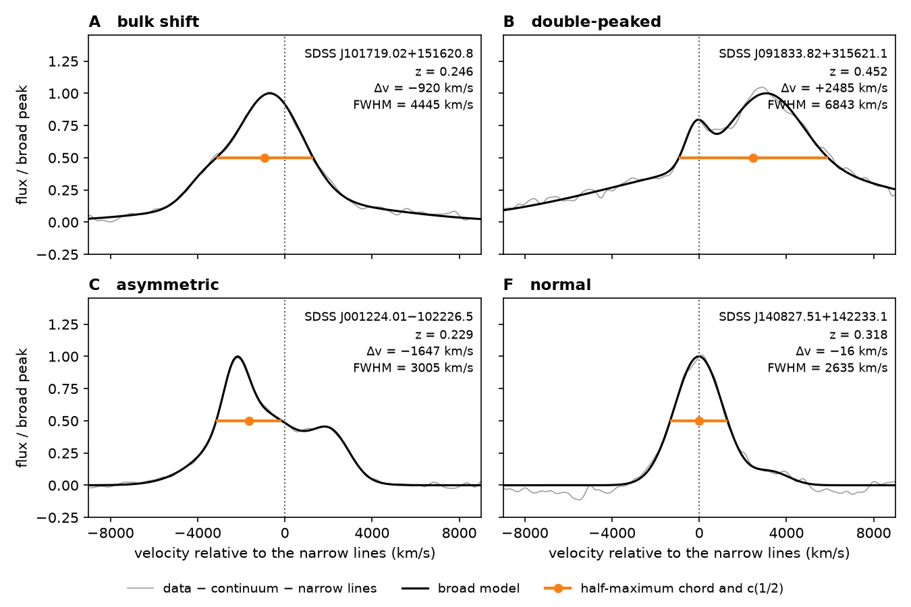

# blrfit

Broad-line profiles, velocity offsets and velocity changes for AGN spectra.

[](https://github.com/ektrnddn/blrfit/actions/workflows/tests.yml)

[](LICENSE)

blrfit fits the Hα and Hβ regions of an optical AGN spectrum and measures the broad-line
profile relative to the narrow lines of the same fit. The model has a power-law, Fe II
and host-galaxy continuum, narrow lines with tied kinematics, and one to three broad
Gaussians chosen with the Bayesian information criterion. The broad profile is then
described without reference to the Gaussians: peak, bisector centres c(f), widths W(f),
and asymmetry and kurtosis indices. Each line gets a shape class and quality flags.
Between the dated spectra of one object, the velocity change of each broad line is
measured by sliding one epoch's fitted profile across the other epoch's data, and the
object is sorted into a candidate tier.

It reads DESI coadds, SDSS spectra and spectra in tables or FITS images, and downloads
public DESI DR1/EDR and SDSS DR17 spectra by DESI TARGETID or sky position.



*Broad Hβ of four SDSS quasars, one of each class, after subtraction of the fitted
continuum and narrow lines (grey, smoothed by 150 km/s), with the broad model (black).
Velocities are relative to the narrow lines; the orange bar is the half-maximum chord and
the dot its midpoint c(1/2), whose velocity is the offset Δv. Made by
`tools/make_readme_figure.py`.*

## Install

```bash
python -m pip install "blrfit[fetch] @ git+https://github.com/ektrnddn/blrfit.git@v0.4.0"
```

Python 3.10 or later. The `fetch` extra is needed only to download public spectra;
`dust` adds the SFD98 map for the Galactic extinction of SDSS and generic spectra
(fetch the map once with `python -c "import dustmaps.sfd; dustmaps.sfd.fetch()"`).

## Quick start

```bash
# a public DESI target (downloads its DR1 coadd)
blrfit fit --targetid 39627574082538900 --out fits

# a local SDSS spectrum (examples/data)
blrfit fit examples/data/spec-0651-52141-0072.fits --survey sdss --z 0.2288 --out fits

# a table: declare its columns, units and frame
blrfit fit spectrum.csv --survey generic --wave lambda --flux flux --err error --z 0.3 --out fits

# many spectra, four at a time, with one catalogue table
blrfit fit spectra/*.fits --survey sdss --jobs 4 --out fits

# the epochs of one object: their fits, the velocity changes between them, the candidate tier
blrfit pair examples/data/spec-0651-52141-0072.fits examples/data/spec-7169-56628-0344.fits --survey sdss --z 0.2288 --out pairs
```

In Python:

```python
import blrfit

sp = blrfit.read_spectrum("spec-0651-52141-0072.fits", survey="sdss")
res = blrfit.fit_spectrum(sp["wave"], sp["flux"], sp["ivar"], z=0.2288, ebv=0.0)
res["meas"]["Hbeta"]["c50_sys"], res["cls"]["Hbeta"]["label"], res["cls"]["Hbeta"]["flags"]

sp2 = blrfit.read_spectrum("spec-7169-56628-0344.fits", survey="sdss")  # the same object, 2013
res2 = blrfit.fit_spectrum(sp2["wave"], sp2["flux"], sp2["ivar"], z=0.2288, ebv=0.0)
rec = blrfit.measure_pair(res, res2, "Hbeta")
rec["s_common"], rec["err"], rec["retained"], rec["flags"]
```

A walk-through with outputs: [examples/quickstart.ipynb](examples/quickstart.ipynb). More on
inputs (DESI, SDSS, tables, public searches, lists, extinction): [docs/inputs.md](docs/inputs.md).

## What you get

For each spectrum, `<name>_fit.json`, a diagnostic figure `<name>_fit.png` and a
printed table; for several spectra, also a catalogue table with units
(`blrfit_summary.fits`). The main quantities, per line:

| Quantity | Meaning |
|---|---|
| `dv` (`c50_sys` in tables) | Δv = c(1/2) − v_n: offset of the half-maximum bisector of the broad profile from the narrow lines, km/s |
| `fwhm`, `W25`, `W75` | widths at 1/2, 1/4 and 3/4 of the broad peak, km/s |
| `v_peak_sys`, `centroid_sys` | peak and flux-weighted centroid of the broad profile relative to the narrow lines, km/s |
| `label` (`class`) | A bulk shift, B double-peaked or disc-like, C asymmetric, F normal; E no broad line, X no narrow-line reference, W too weak or narrow to classify |
| `flags` | warnings, e.g. `degenerate` (equally good decompositions disagree on Δv), `poor_fit`, `edge`, `pl_unphysical` |
| `dv_err_mc` (`e_c50_sys`) | Monte Carlo error of Δv, with `--nmc` |

For the epochs of one object, `blrfit pair` writes a pair table (one row per pair and line:
the change `s_common` of the later epoch relative to the earlier, its error `err_total`, the
shape statistic, the screens and flags), a target table (reference epoch, classes, virial
mass, orbital limits), a tier table and one figure per pair; `blrfit tiers` classifies the
objects of several pair tables.

Every column, unit and flag: [docs/outputs.md](docs/outputs.md).

## How it works

- **Continuum**: a power law, Fe II templates and up to five galaxy eigenspectra (Yip et
  al. 2004), fitted together in line-free windows from several starting points.
- **Narrow lines**: Hα + [N II] + [S II] and Hβ + [O III], with tied kinematics, a wing
  under the narrow lines, and a blue wing of [O III].
- **Systemic velocity v_n**: narrow Hα + [N II], within ±1500 km/s of the input
  redshift; narrow Hβ follows it when narrow Hα is detected.
- **Broad lines**: one to three Gaussians, a further one only when it lowers the BIC by
  more than 10, each fit repeated from several starting velocities.
- **Measurements**: on the summed broad profile, not on the Gaussians.
- **Degeneracy check**: every equally good decomposition is measured, and a spread of Δv
  above 100 km/s flags the line `degenerate`.
- **Classes and flags**: fixed rules applied in order, E, X, W, B, A, C, F.
- **Errors** (optional): Monte Carlo refits of the spectrum perturbed with its pixel
  noise.
- **Velocity changes**: one epoch's fitted broad Gaussians are slid across the other
  epoch's continuum- and narrow-subtracted data, with the flux scale, an offset and a
  slope solved at every trial shift; both directions are measured and averaged; a shape
  statistic tells a moved profile from a changed one, and the narrow lines check the frame.
- **Tiers**: fixed rules on the pairs of an object: disk, binary, platinum (both lines),
  almost, profile, stable, none.

Details, and the reason for each choice: [docs/method.md](docs/method.md).

## Uncertainties

The default is a point fit (`--nmc 0`): no error bars. `--nmc 200` adds Monte Carlo
errors: the spectrum is perturbed with its pixel noise and refitted 200 times, with the
host and the number of broad components held fixed. They are statistical errors,
conditional on the model. On 2,640 synthetic spectra the errors of Δv covered the truth
as they should in all 16 checks, while 5 of the 32 coverage checks of widths and fluxes
were inconclusive. Errors are withheld when the draws split between separate solutions. See
[docs/validation.md](docs/validation.md), which also describes one known failure.

The error of a velocity change is statistical, from the pixel noise of both epochs
through the curvature of the chi-square curve, plus a term per line measured on pairs of
DESI nights with no expected change (45 km/s for Hα, 36 km/s for Hβ), in quadrature. On
synthetic pairs and on such nights the combined error covers the truth at the nominal
rate; injected shifts of up to 2,500 km/s are recovered without attenuation.

## Limitations

- Errors do not include the choice of model: host templates, continuum shape, number of
  broad components.
- With a host, the power law is often steeper than an accretion disc (`pl_unphysical`);
  continuum luminosities of such fits are unreliable, and the masses use the luminosity
  implied by the broad line instead.
- Classes describe shapes. B and C are not disc or binary models, and an offset alone does
  not establish a binary.
- Mg II is fitted but not validated, and a Mg II change carries no calibrated error term.
- Velocity changes are calibrated for Hα and Hβ between DESI nights and between SDSS and
  DESI epochs, at the precision of single DESI spectra; a changed profile is reported but
  never counted as a motion. The earlier `blrfit.rv` is deprecated: importing it warns, and
  it will be removed in 0.5.
- Redshifts are inputs, not measured, and fluxes keep the calibration of the input.

## Citing

Please cite the software with the metadata in [CITATION.cff](CITATION.cff) ("Cite this
repository" on GitHub), and the papers behind the parts you use (listed in
[docs/method.md](docs/method.md#references)).

## Licence

MIT; see [LICENSE](LICENSE). The licence covers the code. The Fe II templates and the
galaxy eigenspectra were obtained from the PyQSOFit repository (Guo, Shen & Wang 2018;
GPL-3.0 code licence) and are the published data of the authors listed in
`blrfit/templates/README.md`.
