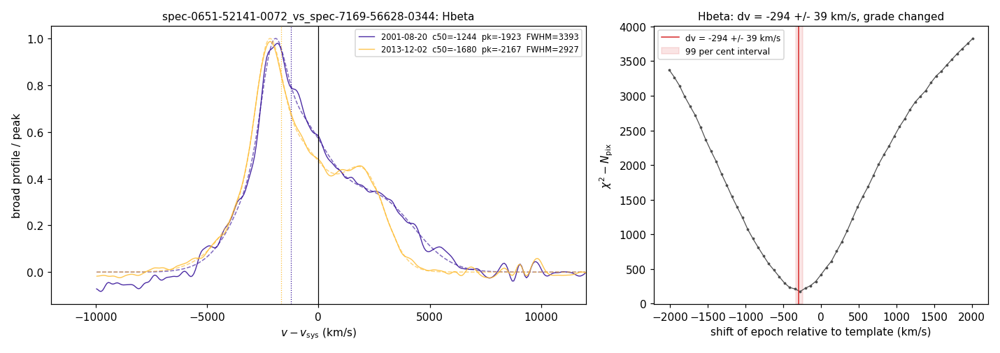

# Historical validation and experimental velocity notes

These sections preserve earlier reports and examples. They are not evidence that
the current release has calibrated survey-wide errors or validated velocity changes.
Some statements describe earlier algorithms and their historical quality tiers.
Use [current validation status](VALIDATION_STATUS.md) and
[uncertainty scope](UNCERTAINTIES.md) for current claims.

## Validation

The historical checks below do not establish general uncertainty calibration. The
[current RC1 status](VALIDATION_STATUS.md) takes precedence over earlier
validation descriptions. Input-interface checks are documented in
[the interface change note](INPUT_INTERFACE.md).

**Identity with the catalogue code.** The package was checked once against the production
fitter on the numerical stack of the catalogue run (numpy 1.26.4, scipy 1.13.1): on 824 SDSS
spectra of the Liu et al. (2014) and Eracleous et al. (2012) objects, 823 fits are identical in
every fitted parameter, measure, class and flag, and the one spectrum that the production code
cannot fit fails identically. The repository pins four of these spectra (`tests/test_pins.py`;
the pins hold the summary row, the fitted parameters, chi-square and BIC of every line, the
continuum parameters, the host information and the [O III] pre-fit). The pin test has two parts.
Everything downstream of the optimiser is a pure function of the data and the parameters and is
checked on every platform to tolerances that only a change of the model, a penalty, a measure or a
class rule can exceed: the continuum and line models, the chi-square with its penalty terms, the
profile measures and the classes are recomputed from the pinned parameters and must agree to a
relative 1e-9 in chi-square, 1e-3 km/s in every velocity and width, a relative 1e-12 in the
parameter entries rebuilt from the free ones and a relative 1e-6 in everything else (bit for bit on
the reference stack). The optimiser's end point is platform dependent: for the degenerate
decompositions of a broad profile into two or three Gaussians the bounded least-squares solver ends
at different points on other versions of scipy and on Linux with another BLAS, and at different
points between runs on the same platform. Measured on the Linux runners of the test workflow and on
numpy 2.5 / scipy 1.18 on macOS, the bisector velocities of a fresh fit move by up to about 30 km/s,
the peak of the two-humped pin and the centroid of one line by up to about 70 km/s, the widths by up
to about 200 km/s, the second-moment width by up to about 500 km/s, and chi-square drops by up to
about 20 per cent when another local minimum is found, without changing a class, a flag or a
component count in any run. The continuum fit is degenerate as well, between the host and the power
law: the host fraction of one pin is 0.14 on the reference stack and 0.10 on a Linux runner, at the
threshold below which the host is rejected, with the same classes and offsets. A fresh fit is
therefore held only to equal classes, flags, component counts and systemic sources, the primary
offset Δv = c(1/2) − v_n within 100 km/s of the pin and a chi-square at most 10 per cent above it;
`BLRFIT_STRICT_PINS=1` requires bit-for-bit equality of everything, the host decision included, and
is the release check on the reference stack. The pins have E(B−V) = 0; the extinction law is pinned
separately (`tests/test_extinction.py`). Every hinge of the chi-square (the far-broad width hinge,
the [O III] width hinge and amplitude ordering, the narrow-line-region wing width hinge) is zero at
the pinned parameters of all four pins; the five penalty functions are pinned at active parameter
values by `test_penalty_terms_pinned`.

**Synthetic spectra** (`tests/test_synthetic.py`, `tests/test_rv_synthetic.py`,
`tests/test_errors_mc.py`; the generator is `tests/synth.py`): bulk shifts of ±1200 km/s at
continuum S/N 6–25 recovered to better than 60 km/s in Hα and 80 km/s in Hβ (measured 1–29 and
2–17 km/s); double-peaked and asymmetric profiles classified B and C; pure narrow-line galaxies
classified E; 85 per cent host light with broad Hα at +800 km/s recovered within 120 km/s
(+817 to +888 km/s over broad equivalent widths of 60–200 Å and S/N 8–15 in the shipped suite;
+721 to +790 km/s in the suite of the paper, whose realisations differ); discrepant [S II]
kinematics; non-Gaussian narrow lines with 25–40 per cent of their flux in a pedestal (a weak
broad Hα at +800 km/s recovered at +734 and +736 km/s; the +379 km/s of a model without the
narrow-line-region wing is a development-suite number, the shipped package cannot switch the wing
off); an [O III] blue wing recovered without moving the systemic velocity; a pedestal wider than
the wing's 510 km/s bound absorbed by the broad components (a documented limit); narrow-line systems displaced by 880 km/s from the input redshift;
lines at the edge of the spectrum; Monte Carlo pulls consistent with unity (NMAD 0.95 in Hα and
1.08 in Hβ over 20 realisations of a broad Hα at +800 km/s, FWHM 4000 km/s, continuum S/N 12).

**The same spectra measured independently.** Runnoe et al. (2015) fitted the SDSS DR7 spectra of
the Eracleous et al. (2012) sample with an independent pipeline. For the 46 spectra (of 69)
without the `poor_fit` or `very_broad` flag, the broad-Hβ peak velocities agree with r = 0.89, a
median difference of −8 km/s and an NMAD of 194 km/s (numbers of the catalogue development run;
not reproduced by a test in this repository); the first moments agree less well (r = 0.71, NMAD
517 km/s), one reason for choosing c(1/2). Liu et al. (2014) published the plate, fibre and date
of the SDSS spectrum of each of their 399 offset quasars with the peak and centroid offsets of
broad Hβ. On the 388 of these spectra that we retrieved from DR16, 370 with a measurable broad Hβ, our
peak offsets agree with theirs with r = 0.91, a median difference of +6 km/s, an NMAD of 104 km/s
and 96 per cent sign agreement; our c(1/2) against their peak gives r = 0.90 and NMAD 127 km/s;
the centroids r = 0.72 and NMAD 313 km/s (the two pipelines define the centroid over different
velocity ranges). For the Eracleous et al. (2012) objects, whose profiles are mostly disk-like or
asymmetric, the peaks agree with r = 0.87 and NMAD 401 km/s over 148 SDSS visits while c(1/2)
agrees much less (r = 0.65, NMAD 893 km/s): for two-humped and skewed profiles the half-maximum
midpoint and the peak are different quantities. The Liu comparison is `tests/test_anchor_liu.py`
(slow; needs the SDSS spectra and the table of Liu et al. 2014, see the test's docstring); it
asserts the peak-offset statistics (n, r, median, NMAD, sign agreement), the other numbers of this
paragraph are quoted from the catalogue run.

**Systematics on the sky** (catalogue development run). Switching the narrow-line-region wing on
and off changes Δv by −3 ± 42 km/s (median ± NMAD over 351 measurable control objects); the choice of systemic
reference changes it by less than 30 km/s; the host treatment matters at the ≲ 150 km/s level in
the most host-dominated objects. All are small against the 1000 km/s selection threshold.

**What changed in 0.2.0.** Version 0.2.0 corrects the defects listed in `CHANGELOG.md`, which
separates bug fixes from changes of policy so that their effects on the catalogue can be told
apart. The effect on every object is tabulated: `docs/deltas_0.1.0_to_0.2.0.csv` holds the four
pinned spectra and the DESI example, `docs/deltas_anchor_0.1.0_to_0.2.0.csv` the 824 SDSS
spectra of the Liu et al. (2014) and Eracleous et al. (2012) anchor (written by
`tests/test_anchor_liu.py` with `BLRFIT_WRITE_DELTAS=1`), both fitted with 0.1.0 and with 0.2.0
on the same numerical stack, one row per spectrum and line with the offsets, widths, classes and
flags of both versions and the selection margin of every class change (`bic_margin`, the
smallest change of a single selection score that would change the chosen component count;
zero on the selection edge, recomputable from the persisted score list `bic_all`; `bic_gap`
keeps the raw score distance to the nearest other count); `docs/DELTAS.md` names the
correction behind each delta. The tag `v0.1.0` reproduces the catalogue run; the numbers of this section were
measured with it.

## Velocity changes between epochs

The multi-Gaussian decomposition of a broad profile is not unique between two noisy
realisations, so c(1/2) of a refitted model can jump with no physical change. `blrfit rv` and
`blrfit.rv.pair_analysis` therefore measure the change by χ² cross-correlation of the continuum-
and narrow-line-subtracted broad profiles, the method of Eracleous et al. (2012), Shen et al.
(2013), Liu et al. (2014), Runnoe et al. (2017) and Guo et al. (2019), in which the fit enters
only through the subtraction. Specifics: whole-pixel shifts on the template's grid. Two spectra on one pixel lattice (two DESI
spectra, or two SDSS spectra on their logarithmic lattice) are compared by integer placement with no
interpolation; only spectra on different lattices are interpolated, onto a uniform velocity grid,
with the interpolation weights carried into the variance (`regridded`). Masked pixels stay masked
in place, so a pixel dropped from one epoch never moves the others. A flux scale and a linear
baseline are profiled at each shift with the noise of both spectra in the variance,
σ²_y + a²σ²_x, so that a brighter or fainter epoch does not change the statistic. The comparison
window is ±1.5 FWHM (at least ±2000 km/s) about the template's c(1/2); 7 per cent of the narrow-line
model is added in quadrature to the pixel errors instead of masking (a masked hole migrates with
the shift and creates false minima at low S/N); the curve statistic is the excess
G(n) = χ²(n) − N_pix(n); outliers beyond 5σ are identified once at the first-pass minimum and
excluded at every shift; a polynomial of degree ≤ 6 over ±10 pixels gives the sub-pixel minimum.
The error is the Δχ² = 6.63 (99 per cent) interval converted to 1σ, its bracketed half when only
one side is bracketed, or the local curvature when neither is, and `err_method` names which. The
shift is measured in both directions (Runnoe et al. 2017) with the mismatch recorded, and a
profile-stability statistic z_prof = (χ²_min − ν)/√(2ν) is reported with both directions' values,
fitted scales and masked-pixel counts. Because χ² − N_pix favours the shifts that use the fewest
pixels whenever the profiles differ, the search runs in two stages, each on the window pixels with
data in both spectra at every one of its shifts: stage 1 locates the minimum over ±vmax (a reduced
range when fewer than half the window's pixels would remain), stage 2 measures the shift, its error
and z_prof within 600 km/s of it. Single-pixel artefacts are masked in both spectra first, and two
checks guard against false minima: the fitted flux factors of the two directions must lie within
1/4 to 4 with a product within 1/2 to 2 (`scale_ok`), and a second minimum within Δχ² = 6.63 of the
first and at least 500 km/s away marks the shift `ambiguous`.

**Narrow-line frame.** Each pair gets one zero point, the shift of the narrow lines of one epoch
against the other, from [O III] λ5007, or from [S II] where [O III] is not measurable (Shen et al.
2013; Runnoe et al. 2015), measured in both directions so that swapping the spectra only changes
its sign; a zero point whose two directions disagree beyond twice their combined error vetoes the
frame. A zero point within ±200 km/s (`FRAME_VETO_KMS`) means the
two spectra share a frame: Hβ is then corrected by it (in the 0.1.0 calibration this reduced the
scatter between consecutive DESI epochs by 21 per cent) and Hα is not (no improvement there). A
larger zero point, or one at the edge of its ±800 km/s search, vetoes the pair for both lines
(`frame_ok` False, with `frame_reason`): a frame offset enters the two Balmer lines identically and
would pass for the coincident two-line change the search looks for.

**Validation and calibration.** The shipped synthetic suite (`tests/test_rv_synthetic.py`) uses
Gaussian broad lines of FWHM 2500, 4000 and 5000 km/s shifted by −600 to +900 km/s. With 0.1.0 the
cross-correlation alone was unbiased at peak S/N 25 and 50 (pooled medians within ±5 km/s over 160
pairs per width), with Δχ² pull NMADs of 0.97, 1.33 and 1.64 at peak S/N 25; the full pipeline was
biased by −25 to −43 km/s at peak S/N 10. Re-measured with 0.2.0 at low S/N, the errors still
undercover: pull NMADs 1.7–2.7, 2.0–4.0 and 4.0–6.9 for the three widths at peak S/N 8, and
1.3–2.0, 1.7–2.7 and 2.5–3.5 at peak S/N 12, with 30 of 160 errors unavailable at FWHM 5000 km/s and
peak S/N 8 (all reported). FWHM ≈ 8000 km/s at peak S/N 8 is a hard regime in which the errors are
not trusted. `blrfit rv --nmc N` (N ≥ 10) replaces the Δχ² error by a bootstrap over both
spectra's errors.

The on-sky floors of the 0.1.0 calibration were measured with the 0.1.0 estimator: on 570 pairs of
consecutive DESI epochs its reliable tier (not at bound, z_prof < 5, direction mismatch below
466 km/s for Hα and 238 km/s for Hβ) needed σ_sys = 155 km/s (Hα) and 79 km/s (Hβ; 157 km/s at S/N
proxy < 8) in quadrature to bring the pulls to unity. They are reported as reference values
(`legacy_error_floor`), not applied: the corrected estimator needs its own calibration. Until then
`blrfit rv` reports the statistical error, labelled uncalibrated, and marks no pair as reliable
(`reliable` is False; `diagnostic_quality_pass` gives the tier conditions of 0.1.0 plus the frame
and plausibility checks). On a first real-data test, 29 objects of the catalogue with two to nine
DESI epochs from the public DR1 release and their SDSS spectra (161 measurable pair records), the
0.1.0 estimator with a 5000 km/s search scattered pairs of DESI epochs weeks apart by 398 km/s in Hα
on its own reliable tier, with shifts of up to 2587 km/s; the corrected estimator gives 58 km/s on
its reliable pairs (17 pairs, largest 355 km/s) and 32 km/s in Hβ (7 pairs), with no reliable shift
above 1500 km/s while it can still search to a median of 3000 km/s. Its statistical errors are still
about three times too small in Hα (pull NMAD 3.4), so an on-sky floor measured with the corrected
estimator remains necessary (`docs/CCF_VALIDATION.md`). The tool reports the shift and its error, the direction
mismatch, z_prof, the zero point and frame check, and the absolute offset at the second epoch,
Δv(t₂) = Δv(t₁) + v_rel.

**Profile grades.** z_prof is a significance, not a size, and it rises with signal-to-noise as
resolution, aperture and calibration differences between two spectra become significant.
`pair_analysis` returns a grade, stable (z_prof < 5), mild (5–10) or changed (≥ 10), and an effect
size, `resid_frac`, the rms of the residual after the best shift, scale and baseline as a fraction
of the template peak. With 0.1.0, z_prof of a pair also grew with the flux ratio of the two epochs,
and the error inflation per grade used by the 0.1.0 tool for pairs across surveys (a null scatter
of 143 km/s for Hα and 147 km/s for Hβ in the stable grade, × 1.15 / × 1.85 for Hα and × 1.4 / × 1.5
for Hβ in the mild and changed grades) was measured with that estimator on an early table of the
catalogue; these values are kept in `constants.py` for reference until the corrected estimator is
calibrated. With `--line Halpha,Hbeta`, `blrfit rv` also evaluates, as an uncalibrated diagnostic,
the two-line criterion of Liu et al. (2014) and Guo et al. (2019): the shifts of the two lines agree
within twice their combined error and, where both are significant, in sign.

*`blrfit rv` 0.1.0 on the 2001 and 2013 SDSS spectra of J001224: the two continuum- and narrow-line-
subtracted Hβ profiles relative to their own systemic velocities (left) and the cross-correlation
excess curve with the 99 per cent interval (right). The 0.1.0 estimator graded this pair 'changed'
(z_prof ≈ 10) because the 2013 spectrum is 2.1 times brighter; with 0.2.0 the pair gives
−293 ± 29 km/s with z_prof 0.8 (stable).*

