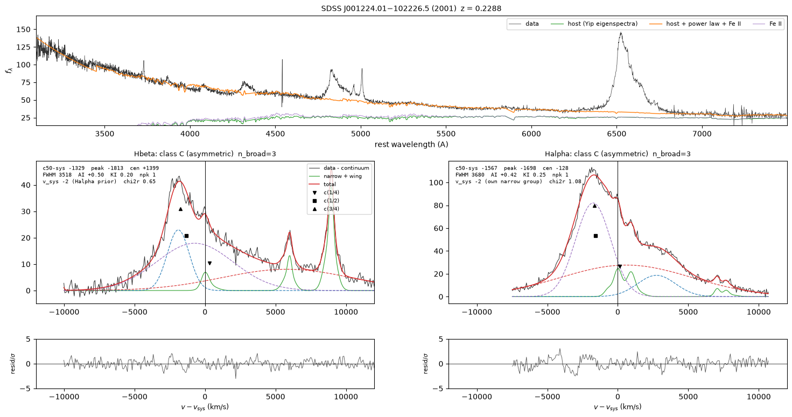

# Outputs

For every spectrum, `blrfit fit` writes `<name>_fit.json` and a diagnostic figure
`<name>_fit.png` (`--no-figure` skips it, `--pickle` adds the full Python result as
`<name>_fit.pkl`). With one spectrum it prints a table; with several it prints one line
per spectrum and writes a catalogue table of all of them. The meaning of each class and
flag is on the [method page](method.md#classes).

*The diagnostic figure of SDSS J001224.01−102226.5 (2001 spectrum): the spectrum and
continuum model, and for each line complex the data, the narrow and broad components and
the residuals.*

## The printed table

One row per line: the class, Δv = c(1/2) − v_n with its Monte Carlo error, the broad peak
and centroid, FWHM, the number of broad Gaussians, the broad flux and peak S/N, A.I. and
K.I., the systemic velocity and its S/N, the [S II] and [O III] velocities relative to
v_n, the [O III] core S/N, and the flags. Below it: the class and its reasons, the
continuum slope and host fraction, and the meaning of every flag that occurs. The
columns are listed by `blrfit fit --help`.

## Catalogue table

With several spectra (or with `--table FILE`) the summary rows are collected into one
table, FITS (`.fits`), ECSV (`.ecsv`) or CSV (`.csv`, without units), one row per spectrum
in the order given, with units. Its first columns identify the spectrum:

| Column | Meaning |
|---|---|
| `spectrum`, `targetid`, `stem` | input file, DESI TARGETID (empty if none), output name |
| `status`, `error` | `fitted` or `failed`, and the reason for a failure |
| `z_source` | where the redshift came from: `argument`, `redrock`, `file` |
| `ebv`, `ebv_source`, `ebv_assumed_zero` | Galactic E(B−V) (mag), its source, and whether 0 was used for lack of a value |
| `flux_unit` | the flux unit of the input |

The remaining columns are the summary row described next. A failed spectrum has empty
(masked) values there.

## Summary row

`summary_row(res)` flattens a fit into one row; it is also stored in the JSON. Velocities
without the suffix `_sys` are relative to the input redshift; with it, relative to the
narrow-line systemic velocity v_n of the same line complex. Fluxes are in the units of
the input spectrum, 10⁻¹⁷ erg s⁻¹ cm⁻² Å⁻¹ for SDSS and DESI.

**Continuum** (one set per spectrum)

| Column | Unit | Meaning |
|---|---|---|
| `z_in` | | input redshift |
| `host_applied`, `host_frac` | | a host component is in the fit; its fraction of the 4200–5000 Å flux |
| `host_undetermined` | | the 4200–5000 Å window carries no signal, so no host was fitted |
| `conti_pl_alpha` | | power-law slope α_λ |
| `conti_pl_norm` | 10⁻¹⁷ erg s⁻¹ cm⁻² Å⁻¹ | power law at 3000 Å, rest-frame flux density |
| `conti_feop_norm`, `conti_feuv_norm` | | multipliers of the optical and ultraviolet Fe II templates (the I Zw 1 templates scaled by 10¹⁵; the optical one peaks at 3.0) |
| `conti_feop_fwhm` | km/s | width of the optical Fe II template |
| `continuum_status`, `conti_at_bound`, `conti_feuv_fwhm_fixed` | | solver state, continuum parameters on a bound, whether the ultraviolet Fe II width was held |
| `conti_start` | | the continuum start kept (0: α = −1.5 with the host at 0.3 of the template scale) |

**Continuum luminosity.** `conti_pl_norm` is a flux density of the rest-frame spectrum
the fit works on, f_rest(λ/(1+z)) = (1+z) f_obs(λ), per rest-frame ångström. The
monochromatic luminosity is therefore λL_λ(5100) = 4π D_L² × 5100 Å × f_rest(5100), with
f_rest(5100) = `conti_pl_norm` × (5100/3000)^`conti_pl_alpha` and no further factor of
1 + z (dividing by it once more understates the luminosity by log₁₀(1 + z) dex).
`blrfit.continuum_luminosity(res)`, and `blrfit.lambda_l_lambda(conti, z)` for a summary
row, compute it with the Planck 2018 luminosity distance used for `broad_lum`; both warn
when the slope is flagged `pl_unphysical`.

**Per line**, with the prefix `HA_`, `HB_` or `MG_`:

| Column | Unit | Meaning |
|---|---|---|
| `class`, `reason`, `flags` | | class, the reasons for it, the quality flags |
| `fit_status`, `converged` | | solver outcome of the line fit |
| `c50_sys` | km/s | **Δv**, the primary offset: c(1/2) − v_n |
| `v_peak_sys`, `centroid_sys`, `c25_sys`, `c75_sys` | km/s | peak, flux-weighted centroid and bisector centres at 1/4 and 3/4 of the peak, relative to v_n |
| `centroid25_sys`, `centroid50_sys` | km/s | centroids of the profile above 1/4 and 1/2 of its peak, relative to v_n |
| `peak_top_sys` | km/s | peak of the continuum- and narrow-subtracted data (a parabola above 80 per cent of its maximum), relative to v_n |
| `v_peak`, `centroid`, `c25`, `c50`, `c75`, `c90`, `peak_top` | km/s | the same quantities relative to the input redshift |
| `fwhm`, `W25`, `W75` | km/s | widths at 1/2, 1/4 and 3/4 of the peak |
| `sigma_line`, `skew` | km/s, — | second moment and standardised third moment of the broad profile |
| `AI`, `KI` | | asymmetry index at 1/4 of the peak; kurtosis index W(3/4)/W(1/4) |
| `n_peaks`, `peak_sep`, `dip_frac` | —, km/s, — | resolved peaks, their separation, the depth of the dip between them |
| `n_broad`, `v_single_gauss` | —, km/s | number of broad Gaussians; the centre of the Gaussian when there is one |
| `broad_flux` | 10⁻¹⁷ erg s⁻¹ cm⁻² | broad-line flux |
| `broad_ew`, `broad_ew_agn` | Å | rest-frame equivalent width against the total and against the AGN-only continuum |
| `conti_at_line` | 10⁻¹⁷ erg s⁻¹ cm⁻² Å⁻¹ | total continuum at the line, rest frame |
| `broad_lum` | erg/s | broad-line luminosity (Planck 2018 cosmology) |
| `broad_flux_snr`, `broad_peak_snr` | | integrated S/N of the broad line; S/N of its peak per pixel |
| `v_sys`, `sig_sys`, `z_sys`, `sys_snr` | km/s, km/s, —, — | systemic velocity and width, the corresponding redshift, and the S/N of the systemic reference |
| `narrow_peak_snr` | | S/N of the strongest narrow line |
| `v_sii`, `sig_sii` | km/s | [S II] velocity and width (Hα) |
| `v_o3`, `v_o3_peak`, `o3_core_snr` | km/s, km/s, — | [O III] core velocity, peak of the [O III] core plus wing, core S/N (Hβ) |
| `v_o3_pre`, `o3_pre_snr` | km/s, — | [O III] velocity and S/N from the preliminary Hβ fit that starts the Hα group |
| `nw_f`, `nw_v`, `nw_sig` | —, km/s, km/s | narrow-line wing: flux fraction, velocity, width |
| `v_cover_lo`, `v_cover_hi` | km/s | velocity range covered by the data around the line |
| `chi2_red` | | reduced χ² of the line fit |
| `bic_margin`, `bic_gap` | | smallest change of a selection score that changes the number of components; distance to the nearest other score |
| `data_v_peak`, `data_c50`, `data_centroid_win` | km/s | peak, c(1/2) and windowed centroid of the lightly smoothed data, relative to the input redshift |
| `dv_spread`, `fwhm_spread`, `n_equivalent` | km/s, km/s, — | the degeneracy check: spread of Δv and FWHM over the equally good decompositions, and their number |
| `n_residual_outliers`, `params_at_bound` | | pixels more than 5σ off the model away from the narrow lines; fitted parameters on a bound |
| `systemic_source` | | the narrow lines that define v_n |

**Monte Carlo** (with `--nmc`), per line:

| Column | Meaning |
|---|---|
| `e_<quantity>` | error of a quantity above (half the 16th–84th percentile range of the draws), in its unit; empty when the errors are withheld |
| `mc_n_requested`, `mc_n_success`, `mc_n_failed`, `mc_n_finite_c50_sys` | draws requested, contributing, failed, and with a finite Δv |
| `mc_n_converged_lines`, `mc_n_converged_both`, `mc_n_unconverged_lines`, `mc_n_unconverged_continuum` | solver convergence over the draws |
| `mc_sigma`, `mc_gap_kms` | NMAD of the Δv draws and their largest gap, km/s |
| `mc_alias_fraction`, `mc_alias_n_assessed`, `mc_alias_n_unassessed` | draws whose v_n or Δv jumped more than 600 km/s from the fit |
| `mc_flags`, `mc_uncertainty_model`, `mc_noise_policy`, `mc_noise_variance_source` | Monte Carlo flags and the noise model used |

## The JSON file

| Key | Content |
|---|---|
| `blrfit_version` | version that wrote the file |
| `input` | path, kind (`desi`, `sdss`, `table`), TARGETID, redshift and its source, E(B−V) and its source, coordinates, date of observation, flux unit, pixel count and wavelength range; for public spectra, the archive record |
| `settings` | every setting of the fit |
| `continuum`, `continuum_solver` | continuum parameters and host; the solver record, including every continuum start |
| `o3_prefit` | the preliminary [O III] fit |
| `lines` | one record per requested line, below |
| `uncertainty`, `mc_info` | whether errors were computed and how; the Monte Carlo bookkeeping, per draw |
| `summary_row` | the summary row above |

Each record in `lines` holds the class (`label`, `class_text`, `reasons`), the flags with
their meanings (`flags`, `flag_text`), the selections (`measurable`, `strong_offset`), the
offset `dv` and its error `dv_err_mc`, the measurements of the summary row under the same
names, the per-quantity Monte Carlo errors (`errors_mc`) and the solver record. A line
outside the data has `fitted: false` and the reason. Values that do not exist are
`null`, never zero. (`dv_err_model` is always `null`; it is kept so that files of earlier
versions and this one can be read alike.)

## Pair table

For the epochs of one object, `blrfit pair` writes `<out>/blrfit_pairs.ecsv` (or `--table`,
FITS, ECSV or CSV), one row per pair and line, with the target and tier tables beside it
(`blrfit_targets.ecsv`, `blrfit_tiers.ecsv`) and one figure per pair and line,
`<A>__<B>_<line>_pair.png`: the two epochs' broad-only data with A's template at the
best shift, the χ² curves of both directions, the pulls at the best shift and the
narrow-line region. The method is on the [method page](method.md#velocity-changes-between-epochs).

| Column | Unit | Meaning |
|---|---|---|
| `targetid`, `pair`, `kind`, `line`, `role` | | the object (`--name`), `<A>__<B>`, the pair kind (`desi-desi`, `sdss-desi`, `sdss-sdss`), the line, and whether the pair is with the reference epoch, consecutive, or both |
| `id_a`, `id_b`, `mjd_a`, `mjd_b`, `dt_days`, `dt_rest_yr` | d, yr | the epochs (A earlier), their dates and the time between them, observed and rest-frame |
| `retained` | | no screen failed: the change is measured |
| `stable_shape`, `shape_max` | | the profile did not change: `shape_max` ≤ 0.5, the shape statistic per pixel, the larger of the two directions |
| `s_common`, `err` | km/s | **the change** of B's broad profile relative to A's, (s − s′)/2, and its statistical error hypot(σ, σ′); withheld (empty) when not retained |
| `sigma_sys`, `err_total` | km/s | the calibrated term of the line and the total error, hypot(`err`, `sigma_sys`) |
| `s_fwd`, `err_fwd`, `s_rev`, `err_rev` | km/s | each direction: A's template over B's data (s), B's over A's (s′) |
| `dir_mismatch` | km/s | \|s + s′\|, zero under noise alone |
| `dv_narrow`, `err_narrow` | km/s | the shift of the narrow lines between the epochs, both directions averaged |
| `s_corrected`, `err_corrected` | km/s | `s_common` − `dv_narrow`, a diagnostic |
| `v_sys_diff`, `dc50_sys`, `dc50_model` | km/s | the differences of the two fits' own systemic velocities, offsets Δv and model c(1/2) |
| `scale_fwd`, `scale_rev` | | the template flux scale of each direction (reciprocal for an honest match) |
| `chi2_nu_fwd`, `chi2_nu_rev`, `chi2_own_nu_fwd`, `chi2_own_nu_rev` | | reduced χ² of the template at its best shift, and of the data epoch's own broad model, per direction |
| `dchi2_shape_fwd`, `dchi2_shape_rev`, `npix_fwd`, `npix_rev` | | the shape statistic of each direction in χ² units and its pixel count |
| `s_alt_fwd`, `dchi2_alt_fwd`, `s_alt_rev`, `dchi2_alt_rev` | km/s, — | the second minimum of each direction and its Δχ² above the first |
| `fwhm_a`, `fwhm_b` | km/s | FWHM of each epoch's broad model |
| `snr_a`, `snr_b`, `peak_snr_a`, `peak_snr_b` | | integrated and peak broad-line S/N of each epoch |
| `cls_a`, `cls_b` | | the class of each epoch's fit |
| `z_a`, `z_b`, `ebv_a`, `ebv_b` | | the redshift and Galactic E(B−V) of each fit |
| `errors_a`, `errors_b` | | where each epoch's statistical errors came from: the input spectrum, the fit result, or (flagged) the fit weights |
| `flags` | | the flags below, joined with `;`; a direction's are prefixed `fwd:` or `rev:`, the narrow comparison's `narrow_fwd:` or `narrow_rev:` |

| Flag | Meaning |
|---|---|
| `at_bound` | χ² minimum at the edge of the ±4000 km/s scan: no shift claimed |
| `flat_minimum` | no curvature at the minimum: no error |
| `ambiguous` | a second minimum within Δχ² = 6.63, more than 500 km/s away |
| `scale_out_of_range` | template flux scale outside 0.25–4: a sliver of the profile was matched |
| `too_few_pixels` | fewer than 20 usable pixels in the window |
| `dir_inconsistent` | the two directions disagree by more than 3σ (an asymmetry of the templates) |
| `scale_product_out_of_range` | the flux scales of the two directions are not reciprocal (product outside 0.5–2) |
| `frame_offset_large` | the narrow lines moved by more than 200 km/s between the epochs: the frame is not shared |
| `no_narrow_template` | no narrow line with a positive amplitude in the template epoch |
| `z_differs`, `ebv_differs` | the two fits used different redshifts or E(B−V) |
| `weights_inconsistent_a`, `_b` | the fit weights of that epoch could not be rebuilt from the given input spectrum |
| `errors_from_fit_weights_a`, `_b` | no statistical errors for that epoch: the fit weights, floor included, were used |
| `line_not_fitted` | the line was not fitted in one of the epochs |
| `uncalibrated_line` | no systematic term for this line (Mg II): `err_total` is the statistical error |
| `dependent` | the two spectra are not independent observations (the same SDSS plate and fibre) |
| `not_retained` | a screen failed: the shift is withheld, the direction values are kept |

## Target table

One row per object: `targetid`, `reference` (the epoch of highest broad-line S/N, the
template of the reference pairs), `n_epochs`, `n_pairs`, the class and integrated S/N of
each line in the reference fit (`class_halpha`, `snr_halpha`, ...), and from that fit the
virial mass `logmbh` (`logmbh_ha` from broad Hα where measurable, else `logmbh_hb`),
`l5100` (erg/s; `l5100_source` says whether it is the power law or, for a fit flagged
`pl_unphysical`, the value implied by the broad Hα or Hβ luminosity, and `l5100_pl` keeps
the power law), the broad-line radius `r_blr_ltd` (light-days) and the orbital limits
`vmax_q01`, `pmin_q01_yr`, `vmax_q1`, `pmin_q1_yr` (km/s and years, for mass ratios 0.1 and
1; [method](method.md#candidate-tiers)).

## Tier table

One row per object, the strongest first: `tier`, `reason` (the pair, line and numbers
behind the verdict), and for the pair behind it `line`, `pair`, `s_kms`, `err_kms`, `sigma`,
`shape_max`, `two_line_agree`, `dt_rest_yr`, `orbital_ok`, the longest allowed periods
`p_max_q01_yr` and `p_max_q1_yr`, `p_min_q1_yr`, `logmbh`, and `n_pairs`. `blrfit tiers`
reads one or more pair tables (and the target tables beside them, or `--targets`) and
writes the same table for all their objects.

## Public searches

`blrfit fit --targetid ...` or `--ra ... --dec ...` writes `inputs/fetch_manifest.json` (every
candidate found and every file downloaded, with checksums), the downloaded spectra under
`inputs/`, one fit per spectrum under `fits/` named after the product
(`desi-dr1-main-dark-17260-39627574082538900`, `spec-0651-52141-0072`), and
`fit_manifest.json` with the outcome of each fit.

## Exit status

0 when every requested fit completed (a line outside the data still completes); 1 when an
input could not be read or a fit failed, including one spectrum of a batch or of a
public search, or when fewer than two epochs could be paired; 2 for a usage error.
